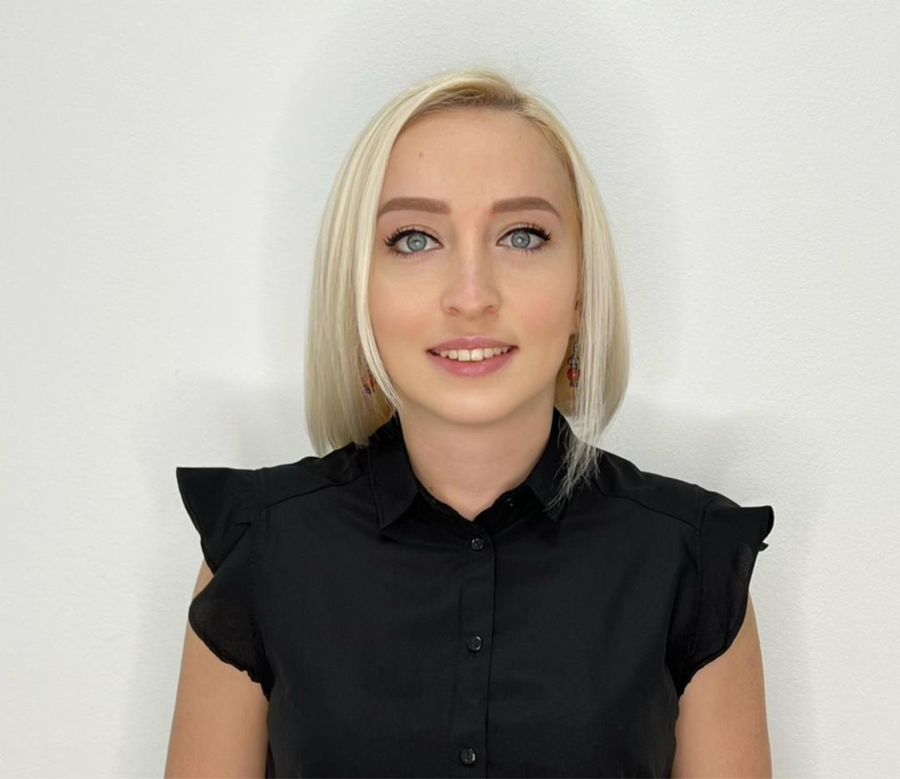

# Resume: **Evgenia Reis** 

## Experience

6 months of experience as a Manual sofware testing engineer in an agile development environment - Android/iOS app in healthcare (health tracker app).

---

## Responsibilities:

*    Analysis and clarification of requirements with the customer
*    Planning the testing process;
*    Writing test scripts;
*    Tracking the life cycle of bugs;
*    Re-test of subordinate defects;
*    Testing analysis;
*    Optimization of the testing process;
*    Analysis of team work processes;
*    Maintaining test documentation.

---

## Hard Skills

*    Ability to write software tests
*    Fluent English
*    Working with Git, working with multiple repositories at the same time
*    Testing web applications, API, understanding client-server interaction working with DevTools, Postman
---

### Contacts:

-   email: evgenia.kgz@gmail.com
-   what's app / telegram: +996 550 42 00 32
-  [LinkedIn](https://www.linkedin.com/in/evgenia-reis-6869935b/)